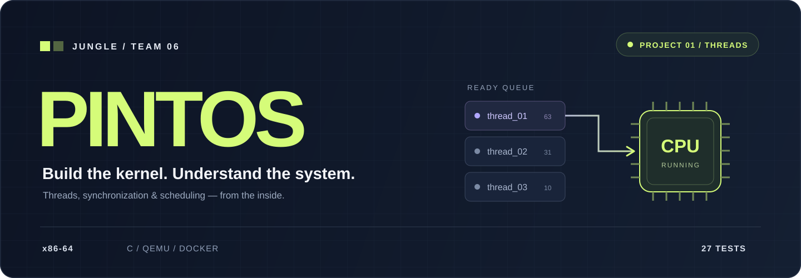

<p align="center">
  
</p>

<div align="center">

### 🌱 작은 커널에서 시작하는, 시스템에 대한 큰 이해.

**KRAFTON JUNGLE · WEEK 07 · TEAM 06**

스레드를 만들고, 실행 순서를 설계하고, 함께 쓰는 자원을 지킵니다.<br />
64비트 Pintos 위에서 운영체제의 동작을 직접 구현하고 검증하는 팀 프로젝트입니다.

**[🗂️ Project Board](https://github.com/orgs/Jungle-Pintos-W7-T6/projects/6)** &nbsp; / &nbsp;
**[🧩 Issues](https://github.com/Jungle-Pintos-W7-T6/pintos_22.04_lab_docker/issues)** &nbsp; / &nbsp;
**[📘 KAIST Manual](https://casys-kaist.github.io/pintos-kaist/)** &nbsp; / &nbsp;
**[🚀 Quick Start](#-quick-start)**

</div>

<br />

## 🛠️ What we're building

이번 주의 초점은 **Project 1 — Threads**입니다. 이미 제공된 스레드 시스템을 읽고, 대기·우선순위·CPU 배분 정책을 확장합니다.

<table>
  <tr>
    <td width="33%" valign="top">
      <h3>⏰ 01 / WAIT SMARTER</h3>
      <strong>Alarm Clock</strong>
      <p>시간을 기다리는 스레드를 블록하고, 기상 시각이 되면 실행 가능한 상태로 돌려놓습니다.</p>
      <sub>Busy waiting → Blocking</sub>
    </td>
    <td width="33%" valign="top">
      <h3>⚡ 02 / RUN WITH PRIORITY</h3>
      <strong>Priority Scheduling</strong>
      <p>높은 우선순위의 스레드를 먼저 실행하고, 락으로 인한 우선순위 역전을 기부로 완화합니다.</p>
      <sub>Preemption · Synchronization · Donation</sub>
    </td>
    <td width="33%" valign="top">
      <h3>📊 03 / ADAPT TO LOAD</h3>
      <strong>MLFQS</strong>
      <p>최근 CPU 사용량과 시스템 부하를 반영해 우선순위를 자동으로 조절합니다.</p>
      <sub>nice · recent_cpu · load_avg</sub>
    </td>
  </tr>
</table>

<br />

## ⚙️ Built on a shared stack

| Layer | Stack | Purpose |
| :--- | :--- | :--- |
| **Architecture** | x86-64 | KAIST Pintos의 64비트 커널 환경 |
| **Language** | C · Assembly | 스레드·동기화·문맥 교환 코드 |
| **Toolchain** | GCC · GNU Make · GDB | 빌드와 디버깅 |
| **Runtime** | QEMU | 커널 실행과 테스트 |
| **Workspace** | Ubuntu 22.04 · Docker · VS Code Dev Containers | 팀이 공유하는 개발 환경 |

환경 설정은 [Dockerfile](.devcontainer/Dockerfile)과 [devcontainer.json](.devcontainer/devcontainer.json)에 있습니다.

<br />

## 🤝 Three tracks. One system.

구현 범위는 세 트랙으로 나누고, 상태 변화와 실행 흐름은 함께 이해합니다. **개인별 담당 배정은 팀에서 확정합니다.**

| Track | Implementation focus | Shared boundary |
| :---: | :--- | :--- |
| **A** | Alarm Clock · MLFQS | 타이머 인터럽트, 기상 처리, 스케줄러 갱신 |
| **B** | 준비 큐 · 우선순위 선점 · 공통 인터페이스 · 통합 조율 | 실행 대상 선택, 우선순위 변경, A·C와의 연결 |
| **C** | 세마포어·조건 변수 대기 우선순위 · 락 우선순위 기부 | 대기자 선택, 다중·중첩 기부, 락 해제 |

**작은 변경을 일찍 공유하고, 경계를 함께 검증합니다.**

- `develop`을 통합 기준으로 사용하고, `main`에는 검증한 변경을 반영합니다.
- 공통 상태·함수의 변경은 먼저 합의하고, 변경 목적과 관련 테스트를 함께 공유합니다.
- 각 담당은 자기 기능의 테스트와 실패 분석을 책임집니다. 교차 실패는 관련 담당이 함께 해결합니다.
- 코드를 작성한 사람 외에도 실행 흐름을 설명할 수 있도록 리뷰합니다.

협업 규칙의 상세 합의는 [팀 협업 룰 이슈 #5](https://github.com/Jungle-Pintos-W7-T6/pintos_22.04_lab_docker/issues/5)에서 관리합니다.

<br />

## 🧪 Quality is part of the work

**27 tests to verify the system.** 아래 숫자는 검증 대상이며, 현재 통과 결과를 나타내지 않습니다.

| Test group | Count | What we check |
| :--- | :---: | :--- |
| **Alarm Clock** | 6 | 수면·반복 수면·동시 기상·기상 우선순위·0과 음수 대기 |
| **Priority & Donation** | 12 | 선점·동일 우선순위 순서·동기화 대기·다중 및 중첩 기부 |
| **MLFQS** | 9 | 시스템 부하·최근 CPU 사용량·공정성·nice·블록된 스레드 갱신 |

서로의 구현이 만나는 테스트는 함께 확인합니다.

| Integration check | Connected tracks |
| :--- | :--- |
| [alarm-priority #12](https://github.com/Jungle-Pintos-W7-T6/pintos_22.04_lab_docker/issues/12) | Alarm Clock ↔ 우선순위 스케줄링 |
| [priority-donate-sema #20](https://github.com/Jungle-Pintos-W7-T6/pintos_22.04_lab_docker/issues/20) | 우선순위 기부 ↔ 세마포어 대기 |
| [mlfqs-block #33](https://github.com/Jungle-Pintos-W7-T6/pintos_22.04_lab_docker/issues/33) | MLFQS ↔ 블록·기상·스케줄링 |

진행 상황과 검증 기록은 **[🗂️ Project Board](https://github.com/orgs/Jungle-Pintos-W7-T6/projects/6)**에서 관리합니다.

<br />

## 🚀 Quick Start

### 1. 팀 저장소 가져오기

호스트 터미널에서 실행합니다. Windows는 PowerShell, macOS·Linux는 기본 터미널을 사용합니다.

```bash
git clone https://github.com/Jungle-Pintos-W7-T6/pintos_22.04_lab_docker.git
cd pintos_22.04_lab_docker
git switch develop
```

### 2. 개발 컨테이너 열기

1. [Docker Desktop](https://www.docker.com/products/docker-desktop/)을 설치하고 실행합니다. Linux는 Docker Engine을 사용할 수 있습니다.
2. [VS Code](https://code.visualstudio.com/)와 [Dev Containers 확장](https://marketplace.visualstudio.com/items?itemName=ms-vscode-remote.remote-containers)을 설치합니다.
3. VS Code에서 저장소의 최상위 폴더를 엽니다.
4. 명령 팔레트에서 **`Dev Containers: Reopen in Container`**를 선택합니다.

컨테이너에는 Git·GCC·Make·GDB·QEMU가 설치됩니다. 설정 상세는 [VS Code 공식 안내](https://code.visualstudio.com/docs/devcontainers/containers)를 참고합니다.

### 3. 빌드와 테스트

**컨테이너 안의 터미널**에서 실행합니다.

```bash
cd /workspaces/pintos_22.04_lab_docker
source pintos/activate
cd pintos/threads
make
make check
```

테스트 결과는 `pintos/threads/build/results`와 각 테스트의 `.result`, `.output`, `.errors`에 생성됩니다. `make check`는 MLFQS 테스트에 필요한 실행 옵션도 적용합니다.

<details>
<summary><strong>🔧 환경·디버깅 메모</strong></summary>

- 이 환경은 `linux/amd64` 기반 Ubuntu 22.04를 사용합니다. 호스트 환경에 따라 문제가 생기면 실행 환경과 로그를 함께 기록합니다.
- 커널 디버깅은 GDB를 사용합니다. 기본 저장소에는 VS Code의 F5 디버깅 구성이 제공되지 않습니다.
- Windows와 컨테이너에서 같은 저장소를 사용할 때는 줄바꿈 설정을 맞춥니다. 전체 파일이 변경으로 표시되면 실제 코드 차이와 줄바꿈 차이를 확인합니다.
- GitHub 인증 설정은 [Dev Containers의 Git 인증 공유 안내](https://code.visualstudio.com/remote/advancedcontainers/sharing-git-credentials)를 참고합니다.

</details>

<br />

## 🧭 Read the code. Trace the state.

```text
pintos_22.04_lab_docker/
├── .devcontainer/          # 팀 개발 환경
├── assets/                 # README 시각 자료
├── pintos/
│   ├── threads/            # 스레드·스케줄러·동기화
│   ├── devices/            # 타이머와 장치
│   ├── include/            # 구조체·인터페이스
│   ├── lib/kernel/         # 리스트 등 커널 자료구조
│   ├── tests/threads/      # Project 1 테스트
│   ├── userprog/           # 사용자 프로그램
│   ├── vm/                 # 가상 메모리
│   └── filesys/            # 파일 시스템
└── README.md
```

처음 읽을 코드: **[thread.h](pintos/include/threads/thread.h)** → **[list.h](pintos/include/lib/kernel/list.h)** → **[thread.c](pintos/threads/thread.c)** → **[timer.c](pintos/devices/timer.c)** → **[synch.c](pintos/threads/synch.c)**.

<br />

## 📚 Learning is a deliverable

과제 목적 → 필요한 개념 → 자료구조 → 스레드 상태 → 실제 코드 → 테스트를 연결합니다.

구현은 직접 하고, AI는 개념 설명·힌트·코드 읽기·리뷰·디버깅에 활용합니다. 테스트가 확인하는 동작과 코드의 상태 변화를 자기 말로 설명하는 것까지 학습 목표에 포함합니다.

| Team record | Link |
| :--- | :--- |
| 이번 주의 역량 목표 | [목표 수립 #1](https://github.com/Jungle-Pintos-W7-T6/pintos_22.04_lab_docker/issues/1) |
| 역량 달성률 평가 | [달성률 평가 #2](https://github.com/Jungle-Pintos-W7-T6/pintos_22.04_lab_docker/issues/2) |
| What I Learned | [WIL 작성 #4](https://github.com/Jungle-Pintos-W7-T6/pintos_22.04_lab_docker/issues/4) |

<br />

---

<div align="center">

**🌴 JUNGLE TEAM 06**<br />
<sub>Build together. Understand together.</sub>

<br /><br />

<sub>Based on <a href="https://github.com/casys-kaist/pintos-kaist">KAIST Pintos</a> and the <a href="https://github.com/krafton-jungle/pintos_22.04_lab_docker">Krafton Jungle Docker environment</a>.<br />
원본 및 수정 코드의 라이선스는 <a href="pintos/LICENSE">pintos/LICENSE</a>를 따릅니다.</sub>

</div>
